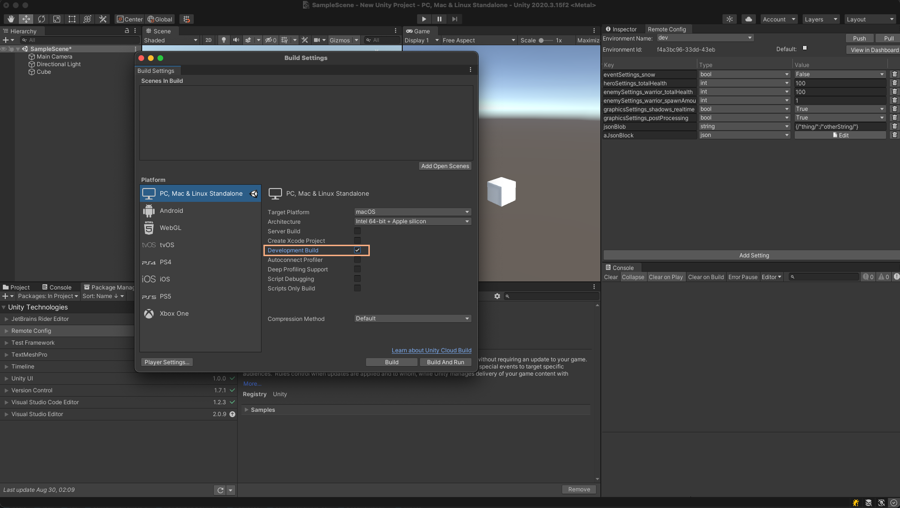

# Configuring your Project for Unity Remote Config

## Requirements

* Unity Remote Config requires Unity Editor 2018.3 or higher for versions 2.0.x, and Unity Editor 2019.4 for versions 3.0.x.
* Set your [Editor scripting runtime](https://docs.unity3d.com/2018.4/Documentation/Manual/ScriptingRuntimeUpgrade.html) to **.NET 4.X Equivalent** (or above).
* Set your [API Compatibility Level](https://docs.unity3d.com/2019.3/Documentation/Manual/dotnetProfileSupport.html) to **.NET 4.x**.
* [Enable Unity Services](https://docs.unity3d.com/2019.3/Documentation/Manual/SettingUpProjectServices.html) for your Project.
* Install the Remote Config package (detailed below).  

## Installing the Remote Config package
See documentation on [packages](https://docs.unity3d.com/2019.3/Documentation/Manual/Packages.html) for more information on working with packages in a Project. These steps may vary depending on which version of the Unity Editor you’re using.

### Verified Release

1. In the Unity Editor, select **Window** > **Package Manager**.
2. From the Package Manager Window find Remote Config in the Packages List View and select it
3. In the Package Specific Detail View select the version and install to import the package into your Project

### Preview Release
1. In the Package Manager Window the **Advanced** button will allow you to toggle **Preview Packages** making them visible in the Package List View
2. Follow the instructions for the Verified Release Installation (directly above this section)

### Beta Customers
Upon receiving the Remote Config package from your account manager, follow these steps:

1. Download and unzip the package.
2. In the Unity Editor, select **Window** > **Package Manager**.
3. Click the plus (**+**) button at the bottom of the Package Manager window to open the **Add package from disk...** dialog.
4. Locate the _package.json_ file inside your unzipped copy of the Remote Config package.
5. Click **Open** to import the package into your Project.

See documentation on [packages](https://docs.unity3d.com/2019.3/Documentation/Manual/Packages.html) for more information on working with packages in a Project. These steps may vary depending on which version of the Unity Editor you’re using.

## Remote Config Environments

To get started, create an environment and give it a name.

1. Go to the [Web Dashboard](http://dashboard.unity3d.com/remote-config).
2. Select the corresponding project.
3. Select **Add Environment**.
4. Enter a name for the environment and select **Create**.

**Note environment names are immutable.**

The first environment you create is set as the default environment. This is the environment which is requested unless otherwise specified by the client. You can assign the default environment to an **EnvironmentID** in the Web Dashboard, or via the REST API.

Once you’ve configured your project, configure your rules and settings in the [Web Dashboard](http://dashboard.unity3d.com/remote-config)
The `production` environment will be the default environment, which is the environment which will be requested unless otherwise specified by the client. The default environment can not be changed. The **EnvironmentID** is an automatically created ID and is viewable in the Remote Config Window in the Editor, via the Web Dashboard, or via the REST API.

The Legacy Remote Config service included only two build environments. Starting with version 1.1.0 developers can create environments, choose the environment used in a build, and set a default environment. **Note the environment name `development` and `production` are reserved names.**

If a 1.0.x version package was used in your Unity Project, there will be 2 environments created for your project; `production` and `development`. Additional environments can be created however the default environment `production` will be delivered unless an `environmentId` is specified in the request, with the ConfigManager API method `SetEnvironmentID`.

For users downgrading from 1.1.x to 1.0.x, an environment with the name `development` will be created if it does not exist.

Deleting the environment named `development` is possible however; using a **Development Build** version of your Unity Project may cause unintended or breaking behavior. Those builds will receive the settings and campaigns from the environment which is set as the default environment.

## Assembly Definition References

The Remote Config package depends on Unity's authentication and core services.
These dependencies require a small amount of user code for proper configuration.

To use Remote Config, you will need to include the following references:
* com.unity.remote-config-runtime
* Unity.Services.Authentication
* Unity.Services.Core

Prior to using Remote Config, you will then need to:
* Initialize Unity Services
  * `UnityServices.Initialize()`
* Authenticate with Unity Authentication
  * `AuthenticationService.Instance.SignInAnonymously()` for anonymous authentication
  * `AuthenticationService.Instance.SignInWithAppleAsync()` for apple authentication
  * `AuthenticationService.Instance.SignInWithFacebookAsync()` for facebook authentication
  * `AuthenticationService.Instance.SignInWithGoogleAsync()` for google authentication
  * `AuthenticationService.Instance.SignInWithSteamAsync()` for steam authentication
  * `AuthenticationService.Instance.SignInWithSessionTokenAsync()` for authentication with an existing token

## Legacy Remote Config Environments (Only for packages in version range <=1.0.x)

### Development environment
Remote Config sends settings from the Development environment to builds marked as development builds.

**Note**: For Unity to request the Development environment settings, you must check the **Development Build** setting in the [Build Settings window](https://docs.unity3d.com/2019.3/Documentation/Manual/BuildSettings.html) when building your application.

### Production environment
Remote Config sends settings from the `production` environment to any non-development builds.

**Note**: The Editor’s Play mode always uses the Development environment settings.

Once you’ve configured your Project, start configuring your [Campaigns and Settings](CampaignsAndSettings.md) in the **Remote Config** window and the Web Dashboard.
